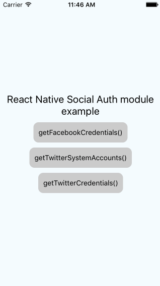

## Setup

1. Git clone

  ```javascript
    git clone  https://github.com/xxsnakerxx/react-native-social-auth.git
  ```

2. Install dependencies

  ```javascript
  cd example && npm install --save
  ```
  


## Contributing

Just submit a pull request!

## Copyright and license

Code and documentation copyright 2015 Dmitriy Kolesnikov. Code released under the [MIT license](LICENSE).
